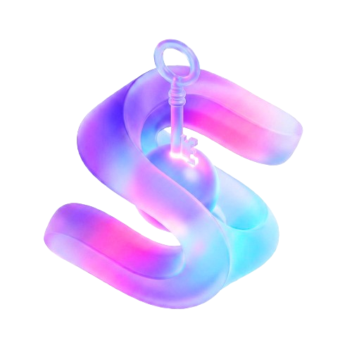

<h1 align="center">
  
  <br />
  <b>SecurityDept</b>
</h1>

SecurityDept is a layered authentication and authorization toolkit. It ships as reusable Rust crates, TypeScript SDK packages, and reference applications that validate the same contracts in real server and browser deployments.

Current release line: `0.2.0-beta.3`. This beta line is focused on packaging, documentation, release automation, and reference-app readiness for the existing auth stack.

<p class="badges" align="center">
  <a href="https://www.npmjs.com/package/@securitydept/client"></a>
  <a href="https://crates.io/crates/securitydept-core"></a>
  <a href="https://github.com/ethaxon/securitydept/pkgs/container/securitydept"></a>
  <a href="https://github.com/ethaxon/securitydept/actions/workflows/tests.yml"></a>
  <a href="https://github.com/ethaxon/securitydept/actions/workflows/docs.yml"></a>
</p>

## Use SecurityDept

### Rust Crates

Use the Rust crates when you are building server-side auth flows, credential verification, OIDC/OAuth integration, or framework-neutral auth-context services.

Primary crate families:

- `securitydept-creds`, `securitydept-creds-manage`, `securitydept-realip`
- `securitydept-oidc-client`, `securitydept-oauth-provider`, `securitydept-oauth-resource-server`
- `securitydept-basic-auth-context`, `securitydept-session-context`, `securitydept-token-set-context`
- `securitydept-core` for aligned downstream re-exports

Typical example: enable the `session-context` surface through `securitydept-core`, then build the session payload with the re-exported types.

```bash
cargo add securitydept-core --features session-context
```

```rust
use securitydept_core::session_context::{
  SessionContext,
  SessionContextConfig,
  SessionPrincipal,
};

let session_config = SessionContextConfig::default();
let session = SessionContext::builder()
  .principal(
    SessionPrincipal::builder()
      .subject("dev-session")
      .display_name("dev")
      .build(),
  )
  .build();
```

That is the recommended Rust entry style in this repo: depend on `securitydept-core`, turn on only the features you need, and import the product surface through its re-exports.

Start with [Architecture](docs/en/001-ARCHITECTURE.md) and [Auth Context and Modes](docs/en/020-AUTH_CONTEXT_AND_MODES.md).

### TypeScript SDKs

Use the npm packages when you are building browser, React, Angular, or host-framework integrations for SecurityDept auth-context modes.

Published SDK families:

- `@securitydept/client`, `@securitydept/client-react`, `@securitydept/client-angular`
- `@securitydept/basic-auth-context-client`, `@securitydept/basic-auth-context-client-react`, `@securitydept/basic-auth-context-client-angular`
- `@securitydept/session-context-client`, `@securitydept/session-context-client-react`, `@securitydept/session-context-client-angular`
- `@securitydept/token-set-context-client`, `@securitydept/token-set-context-client-react`, `@securitydept/token-set-context-client-angular`

Typical example: wire a browser-only Basic Auth entry with `@securitydept/basic-auth-context-client`.

```bash
pnpm add @securitydept/basic-auth-context-client
```

```ts
import {
  AuthGuardResultKind,
  BasicAuthContextClient,
} from "@securitydept/basic-auth-context-client";

const client = new BasicAuthContextClient({
  baseUrl: "https://auth.example.com",
  zones: [{ zonePrefix: "/basic" }],
});

const result = client.handleUnauthorized("/basic/api/groups", 401);

if (result.kind === AuthGuardResultKind.Redirect) {
  window.location.href = result.location;
}
```

That is the minimal SDK entry: detect a zone-scoped `401` and redirect the browser to the matching login route.

The canonical SDK entrypoint is [Client SDK Guide](docs/en/007-CLIENT_SDK_GUIDE.md). Treat `apps/webui/src/api/*` as reference-app glue, not public SDK API.

### Reference App And Docker Image

The reference runtime combines the Axum server and web UI to dogfood:

- Basic Auth, cookie-session, and token-set auth-context modes
- browser / React / Angular SDK adapter ergonomics
- protected management APIs, bearer propagation, real-IP policy, route guards, and release packaging

Typical example: fetch the published sample config and compose file, then start the reference image locally.

```bash
wget -O config.toml https://raw.githubusercontent.com/ethaxon/securitydept/main/config.example.toml
wget -O docker-compose.yml https://raw.githubusercontent.com/ethaxon/securitydept/main/docker-compose.yml
docker compose up -d
```

If you only want the smallest compose skeleton, it looks like this:

```yaml
services:
  securitydept-server:
    image: ghcr.io/ethaxon/securitydept:latest
    ports:
      - "7021:7021"
    environment:
      SECURITYDEPT_CONFIG: /app/config.toml
    volumes:
      - ./config.toml:/app/config.toml
      - ./data:/app/data
```

The reference app is then exposed on `http://localhost:7021`.

The Docker image is built by the `Docker Build` workflow and tagged through `scripts/release-cli.ts docker publish`; see [Release Automation](docs/en/008-RELEASE_AUTOMATION.md).

## Develop This Repository

Use the repository docs when changing SecurityDept itself:

- [Overview](docs/en/000-OVERVIEW.md) for the document map and current artifact boundaries
- [Features](docs/en/002-FEATURES.md) for implemented vs planned capability status
- [Error System Design](docs/en/005-ERROR_SYSTEM_DESIGN.md) for response-envelope and diagnostics rules
- [Reference App: Outposts](docs/en/021-REFERENCE-APP-OUTPOSTS.md) for real adopter calibration
- [Roadmap](docs/en/100-ROADMAP.md) for current release state and deferrals
- [TS SDK Migrations](docs/en/110-TS_SDK_MIGRATIONS.md) for public-surface migration records

Local setup:

```bash
mise install
pnpm install
just setup-docs
```

Common loops:

```bash
just dev-server
just dev-webui
just lint
just test
just build-docs
```

## Project Boundaries

- SecurityDept is not a single monolithic auth service; it is a layered stack of reusable crates, SDKs, and reference apps.
- The long-term product auth-context surfaces are Basic Auth context, session context, and token-set context.
- Higher-complexity token-set deployments such as mixed custody, BFF, and server-side token ownership are not part of the current beta contract unless documented in the SDK guide.
- Historical status belongs outside user-facing docs; stable docs should describe current behavior or explicit future plans.

## Docs Site

Source docs live in `docs/en` and `docs/zh`. The VitePress docsite in `docsite/` uses Git-compatible symlinks to those source docs and is built independently from the main app build.

Planned public URL: `https://securitydept.ethaxon.com/`.

## License

[MIT](LICENSE.md)

---

[English](README.md) | [中文](README_zh.md)
